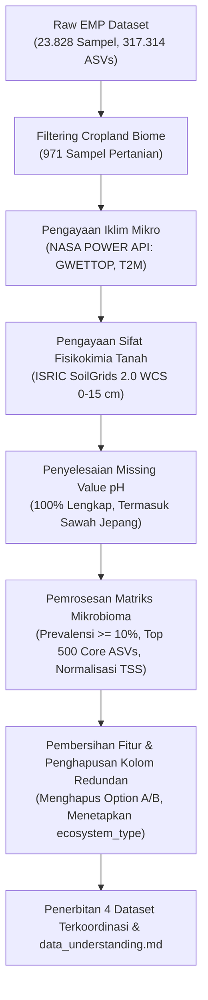

# RINGKASAN PROGRESS & PANDUAN KERJA SKRIPSI (PROJECT SUMMARY)
## Analisis Komparasi Jaringan Ko-okurensi Mikrobioma Tanah Cropland: Lahan Basah (*Wetland Paddy*) vs Lahan Kering (*Dryland Cropland*)
**Penyusun:** Diko Duwi Saputra  
**Tanggal Update Terakhir:** September 2026  
**Folder Kerja Utama:** `d:\DATA SKRIPSI\skripsi_mikrobioma_tanah`

---

## 1. Kilas Balik: Apa yang Telah Kita Selesaikan Sejauh Ini?

Berikut adalah rekam jejak sistematis dari seluruh tahapan pemrosesan data yang telah berhasil dikerjakan:



### Detail Capaian per Tahap:
1. **Filtering Sampel Pertanian (*Cropland*)**:
   - Memfilter 971 sampel tanah non-salin pada bioma pertanian dari dataset raksasa *Earth Microbiome Project (EMP)*.
2. **Pengayaan Data Iklim Satelit (*NASA POWER*)**:
   - Mengambil data kelembaban tanah permukaan (`soil_moisture_gwettop`, 0.0–1.0) dan suhu tanah (`soil_temperature_t2m`, °C) berdasarkan koordinat spasial dan tanggal pengambilan sampel.
3. **Pengayaan Data Fisik-Kimia Tanah (*ISRIC SoilGrids 2.0*)**:
   - Mengambil 8 parameter tanah utama: pH H2O, C-organik (SOC), total nitrogen, KTK (CEC), tekstur (liat, pasir, debu), dan *bulk density* pada lapisan olah perakaran (*topsoil* 0–15 cm).
   - Mengatasi masalah koordinat batas pesisir (pada 309 sampel lahan sawah Study 1642 Jepang) menggunakan pencarian radius adaptif (*adaptive buffer*), sehingga **nilai pH kini 100% lengkap (0 missing value)**.
4. **Penyaringan Rare OTUs & Normalisasi TSS**:
   - Dari 317.314 ASVs, disaring taksa dengan prevalensi $\ge 10\%$ ($\ge 97$ sampel) dan dipilih **Top 500 Core ASVs** yang mencakup $>84\%$ biomassa sekuens mikroba pertanian global.
   - Melakukan normalisasi baris *Total Sum Scaling* (TSS) sehingga jumlah proporsi kelimpahan per baris sampel bernilai tepat 1.0.
5. **Penyederhanaan Kolom & Ramah Koding (*Coding-Friendly*)**:
   - Menghapus kolom pembagian teknis `option_a_group` dan `option_b_group` agar tabel tidak membingungkan saat coding.
   - Menyederhanakan kolom pembeda utama menjadi satu kolom tunggal yang intuitif: **`ecosystem_type`** (`Wetland_Paddy` [309 sampel] vs `Dryland_Cropland` [662 sampel]).
   - Menyediakan kolom pH bersih **`ph`** (tanpa embel-embel `_final` atau `soilgrids_`).
6. **Penyusunan Kamus Data & Panduan Ilmiah**:
   - Menghasilkan file dokumentasi lengkap **`data_understanding.md`** yang memuat kamus data, ulasan ilmiah peran ekologis tanah, resep koding Python, dan panduan menjawab pertanyaan sidang.

---

## 2. Peta Navigasi Folder `skripsi_mikrobioma_tanah/`

Agar Anda tidak pusing melihat banyaknya file, berikut adalah struktur folder dan panduan file mana yang harus Anda gunakan:

```
skripsi_mikrobioma_tanah/
│
├── SUMMARY.md                       <-- [DOKUMEN INI] Ringkasan progres & peta jalan kerja
├── data_understanding.md            <-- Panduan kamus data, ulasan ilmiah Bab 2/4, & resep koding
│
├── notebooks/
│   └── 01_eda_and_network_analysis.ipynb <-- [NOTEBOOK UTAMA] EDA tanah, diversitas alfa, taksonomi, NetworkX & PyVis
│
├── data/
│   ├── processed/                   <-- [FOLDER DATA UTAMA] Buka file di sini untuk koding/analisis
│   │   ├── cropland_merged_analysis_dataset.csv  <-- FILE PALING UTAMA (Metadata bersih + 500 ASV)
│   │   ├── cropland_clean_metadata.csv           <-- Khusus metadata tanah & biodiversitas saja
│   │   ├── microbiome_core_relative_abundance.csv <-- Khusus matriks 500 ASV (TSS normalized)
│   │   ├── taxonomy_core_annotation.csv          <-- Kamus taksonomi 7 tingkat ASV_001 s/d ASV_500
│   │   └── cropland_enriched_metadata.csv        <-- Arsip metadata lengkap 90 kolom (provenance)
│   └── raw/                         <-- Arsip data mentah (bisa diabaikan saat koding sehari-hari)
│
├── scripts/                         <-- [FOLDER SKRIP OTOMASI]
│   ├── 01_enrich_cropland_metadata.py     <-- Skrip pengayaan NASA POWER & SoilGrids
│   ├── 02_run_network_pipeline.py         <-- Skrip analisis jaringan ko-okurensi & keystone
│   ├── 03_process_microbiome_and_merge.py <-- Skrip pemrosesan ASV & penggabungan dataset
│   └── 04_eda_and_filtering.py            <-- Skrip CLI otomatisasi EDA & pemfilteran dinamis
│
├── results/                         <-- [FOLDER OUTPUT ANALISIS]
│   ├── figures/                     <-- Gambar visualisasi beresolusi tinggi (300 DPI) untuk Bab 4
│   │   ├── fig1_soil_physicochemical_comparison.png
│   │   ├── fig2_alpha_diversity_comparison.png
│   │   ├── fig3_phylum_composition_stacked.png
│   │   ├── fig4_top_genera_comparison.png
│   │   └── fig5_spearman_correlation_heatmap.png
│   ├── networks/                    <-- File .graphml (Gephi) & .html graf interaktif (PyVis)
│   │   ├── Wetland_Paddy_network.graphml
│   │   ├── Dryland_Cropland_network.graphml
│   │   ├── wetland_paddy_network.html
│   │   └── dryland_cropland_network.html
│   └── tables/                      <-- Tabel ringkasan metrik topologi & keystone species
│       ├── comparative_topology_summary.csv
│       ├── mann_whitney_soil_comparison.csv
│       ├── Wetland_Paddy_keystone_species.csv
│       └── Dryland_Cropland_keystone_species.csv
│
└── dashboard/                       <-- Komponen Dashboard Web Streamlit Interaktif
    ├── app.py                       <-- Aplikasi web Streamlit 3-Tab (Network, Keystone, Sifat Tanah)
    └── data_processing.py           <-- Backend data loading, filtering, NetworkX & PyVis (@st.cache_data)
```

---

## 3. Ringkasan Statistik Data Utama (Quick Facts untuk Skripsi)

* **Total Sampel Analisis**: **971 sampel tanah pertanian global**.
* **Klasifikasi Agroekosistem (`ecosystem_type`)**:
  * **`Wetland_Paddy` (Lahan Sawah Basah)**: **309 sampel** (didominasi kondisi tergenang air/anaerobik).
  * **`Dryland_Cropland` (Lahan Kering Pertanian)**: **662 sampel** (didominasi kondisi aerobik berpori).
* **Profil Sifat Tanah Kunci**:
  * **pH Tanah (`ph`)**: Rata-rata 5.71 (rentang masam 4.40 hingga agak alkalis 7.60).
  * **Kelembaban Tanah (`soil_moisture_gwettop`)**: Rata-rata 0.58 (sawah: $>0.75$, lahan kering: $<0.55$).
  * **Karbon Organik Tanah (`soil_organic_carbon_g_kg`)**: 23.13 – 266.97 g/kg.
  * **Tekstur Tanah**: Total fraksi liat + pasir + debu konsisten 100%.
* **Komposisi Filum Inti Bakteri (Top 5 dari 500 Core ASVs)**:
  1. *Proteobacteria (Pseudomonadota)*: 176 ASV (35.2%) — Perombak hara cepat (kopiotrof).
  2. *Acidobacteria (Acidobacteriota)*: 113 ASV (22.6%) — Spesialis tanah masam & bahan organik kompleks.
  3. *Bacteroidetes (Bacteroidota)*: 55 ASV (11.0%) — Pendegradasi bahan tanaman segar.
  4. *Verrucomicrobia (Verrucomicrobiota)*: 39 ASV (7.8%) — Bakteri tanah alami oligotrof.
  5. *Actinobacteria (Actinomycetota)*: 37 ASV (7.4%) — Toleran kering, pembentuk spora.

---

## 4. Panduan Menjalankan Analisis Selanjutnya (Next Steps)

Ketika Anda membuka kembali proyek ini, berikut adalah langkah konkret yang bisa langsung Anda jalankan:

### Langkah 1: Koding Eksplorasi Data & Statistik Deskriptif
Gunakan file `skripsi_mikrobioma_tanah/data/processed/cropland_merged_analysis_dataset.csv`.
Contoh kode Python dasar:
```python
import pandas as pd

# Load data siap analisis
df = pd.read_csv('skripsi_mikrobioma_tanah/data/processed/cropland_merged_analysis_dataset.csv')

# Periksa perbandingan sifat tanah antara Sawah vs Lahan Kering
print(df.groupby('ecosystem_type')[['ph', 'soil_organic_carbon_g_kg', 'soil_moisture_gwettop', 'shannon_diversity']].mean())
```

### Langkah 2: Menjalankan Analisis Jaringan Ko-okurensi (*Co-occurrence Network*)
Jalankan skrip pipeline jaringan yang telah disesuaikan:
```bash
python skripsi_mikrobioma_tanah/scripts/02_run_network_pipeline.py
```
*Output yang dihasilkan di folder `results/`:*
* File `.graphml` (dapat dibuka di software **Gephi** untuk membuat gambar jaringan mikrobioma yang indah untuk Bab 4).
* File `.csv` metrik topologi (jumlah node, edge, modularity, average clustering coefficient).
* Daftar peringkat **Keystone Species** (spesies bakteri kunci pembentuk struktur ekosistem sawah vs lahan kering).

### Langkah 3: Penulisan Naskah Skripsi
Buka dokumen **`data_understanding.md`** sebagai referensi utama saat menulis:
* **Bab 3 (Metodologi)**: Rujuk bagian normalisasi TSS, ambang batas prevalensi 10%, dan data geospasial ISRIC SoilGrids 2.0 (sitasi: *Poggio et al., 2021*).
* **Bab 4 (Hasil dan Pembahasan)**: Rujuk penjelasan ilmiah ekologis tentang pengaruh pH, kelembaban, dan perbandingan sifat tanah lahan basah vs kering.
* **Persiapan Sidang**: Pelajari bagian *Defense FAQ* di akhir dokumen `data_understanding.md`.

---
*Dokumen ini dirancang sebagai panduan serah-terima (*handover guide*) agar Anda dapat melanjutkan penelitian skripsi dengan nyaman, tenang, dan terstruktur tanpa kebingungan.*
